# Smart Environment: Intrusion Detection — Technical Report

This report describes computer-vision system that detects motion inside
predefined restricted areas of a video feed and raises an interpretable alarm.
The system follows a mandatory five-stage pipeline (Enhance, Segment, Clean, Detect,
Decide) and produces auditable event logs. No deep learning or training data is
required.

---

## 1. Problem Description

**Objective.** Given a static-camera video feed, automatically determine whether any
moving object has entered a user-defined restricted zone and emit a binary ALARM signal
for each intrusion event.

**Constraints and assumptions:**

- Camera is static; background is approximately stationary between adaptation cycles.
- Processing must run in real time on standard hardware.
- Detection must be interpretable: each decision is backed by visible bounding boxes,
  a coloured zone overlay, and a timestamped CSV event log.
- Three representative test clips are provided: `walk.mp4`, `thieves.mp4`,
  `intruder.mp4`.

---

## 2. Team Roles and Task Division

| Role | Name | Responsibilities | Primary modules |
|------|------|-----------------|-----------------|
| Lead CV Engineer | *Daniil Prybyshchuk* | Pipeline integration, detection logic, zone decision | `main.py`, `analytics.py` |
| Image Processing Specialist | *Daniil Prybyshchuk, Mikita Besau* | Enhancement, background subtraction, segmentation | `preprocessing.py` |
| Morphology and Report Lead | *Mikita Besau* | Mask refinement, event logging, technical documentation | `filtering.py`, `events.py`, `README.md` |

---

## 3. Pipeline Design

Each video frame passes through five sequential stages:

```
Raw frame
  └─[1. Enhance]──> denoised / contrast-adjusted frame
        └─[2. Segment]──> binary foreground mask  (MOG2 + threshold)
              └─[3. Clean]──> refined mask  (morphological open → close)
                    └─[4. Detect]──> bounding boxes around moving contours
                          └─[5. Decide]──> zone-intersection test → ALARM + CSV row
```

**Stage-to-file mapping:**

| Stage | Operation | File |
|-------|-----------|------|
| 1. Enhance | Adaptive denoise + CLAHE / sharpen | `src/preprocessing.py` |
| 2. Segment | MOG2 background subtraction + threshold | `src/preprocessing.py` |
| 3. Clean | Morphological open + close | `src/filtering.py` |
| 4. Detect | Contour extraction + bounding boxes | `src/analytics.py` |
| 5. Decide | Zone-intersection test, alarm overlay, CSV log | `src/analytics.py`, `src/events.py` |

---

## 4. Methods Used

### 4.1 Enhancement (Stage 1)

A hysteresis-based brightness detector (thresholds `LOW_LIGHT_ENTER = 70`,
`LOW_LIGHT_EXIT = 90`) switches between two enhancement paths:

- **Low-light mode:** CLAHE (`clipLimit = 3.0`, tile grid `8×8`) equalises the
  grayscale channel to recover detail, followed by a mild `3×3` Gaussian blur to
  suppress amplified noise.
- **Normal mode:** a `3×3` unsharp-mask kernel sharpens edges, followed by a `5×5`
  Gaussian blur to smooth high-frequency artefacts before segmentation.

### 4.2 Segmentation (Stage 2)

`cv2.BackgroundSubtractorMOG2` models the background with a Gaussian mixture over
the last `history = 500` frames (`varThreshold = 25`, shadow detection enabled).
The raw probability mask is binarised with `threshold = 200`, removing low-confidence
shadow pixels (labelled 127 by MOG2) and producing a clean foreground mask.

### 4.3 Mask Cleaning (Stage 3)

A `5×5` rectangular structuring element is applied in two passes:

1. **Morphological opening** (erode → dilate) removes small isolated noise blobs.
2. **Morphological closing** (dilate → erode) fills internal holes so each moving
   body is represented as a solid region.

### 4.4 Detection (Stage 4)

`cv2.findContours` extracts external contours from the cleaned mask.
Contours smaller than `MIN_CONTOUR_AREA = 400 px²` are discarded as residual noise.
The remaining contours each produce a bounding rectangle drawn in green (`OBJECT`)
or red (`INTRUDER`) depending on the zone test.

### 4.5 Decision (Stage 5)

For each bounding box `(x, y, w, h)`, an axis-aligned intersection test checks
whether it overlaps the restricted zone `(x1, y1, x2, y2)`:

```
intruding = NOT (x+w < x1 OR x > x2 OR y+h < y1 OR y > y2)
```

If any box intersects the zone, the frame is flagged as an intrusion: the zone
outline turns red, a full-width red banner reads "INTRUSION DETECTED", and an
edge-triggered `EventLogger` appends `INTRUSION_START` / `INTRUSION_END` rows to
`outputs/events.csv` with timestamp, duration, and bounding-box coordinates.

### 4.6 Key configuration parameters (`src/config.py`)

| Parameter | Value | Effect |
|-----------|-------|--------|
| `MOG2_HISTORY` | 500 | Frames over which background model adapts |
| `MOG2_VAR_THRESHOLD` | 25 | Sensitivity of foreground detection |
| `SEGMENT_THRESHOLD` | 200 | Removes shadow pixels (127) from mask |
| `CLAHE_CLIP_LIMIT` | 3.0 | Contrast cap in low-light CLAHE |
| `KERNEL_SIZE` | (5, 5) | Morphological structuring element size |
| `MIN_CONTOUR_AREA` | 400 | Minimum blob size to treat as a target |
| `LOW_LIGHT_ENTER` | 70 | Mean brightness to enter low-light mode |
| `LOW_LIGHT_EXIT` | 90 | Mean brightness to exit low-light mode |

---

## 5. Results

Stage images below are captured from the first frame where an intrusion is detected
in each test clip (after a 60-frame MOG2 warm-up). They are generated automatically
by `src/export_stages.py` and stored in `docs/images/`.

### 5.1 `walk.mp4`

| Stage 0 — Original | Stage 1 — Enhanced | Stage 2 — Segmented |
|---|---|---|
| 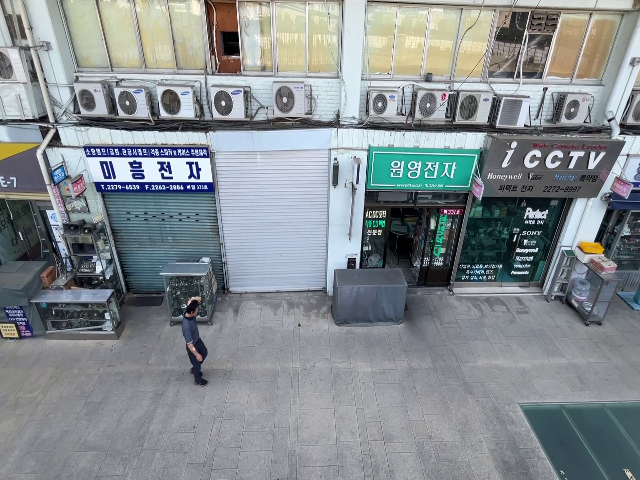 | 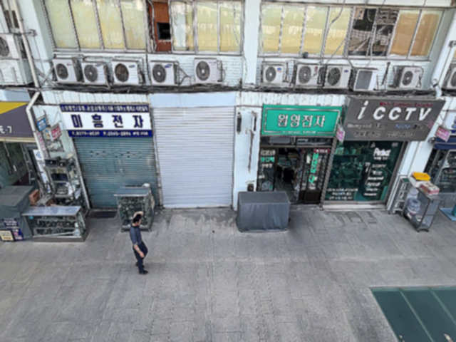 | 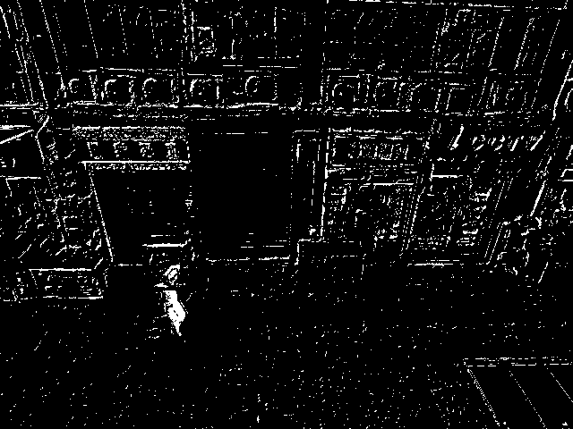 |

| Stage 3 — Cleaned | Stage 4 — Final Decision |
|---|---|
| 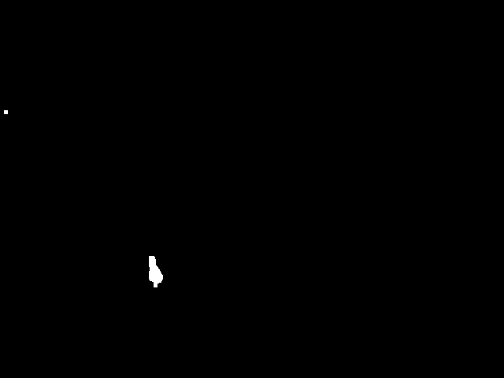 | 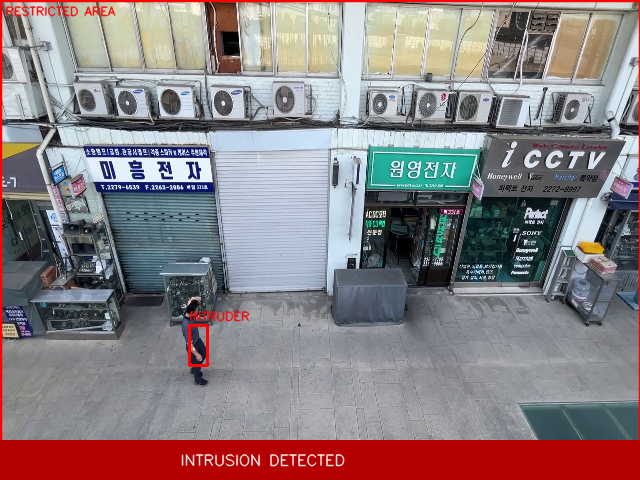 |

*Outcome:* A single pedestrian walking across the full-frame zone triggers a
sustained intrusion event. The bounding box tracks the subject throughout.

### 5.2 `thieves.mp4`

| Stage 0 — Original | Stage 1 — Enhanced | Stage 2 — Segmented |
|---|---|---|
| 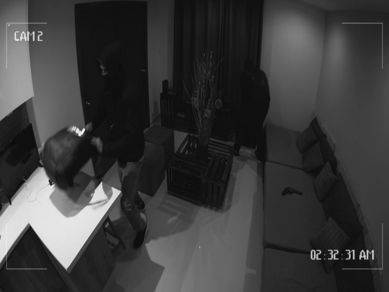 | 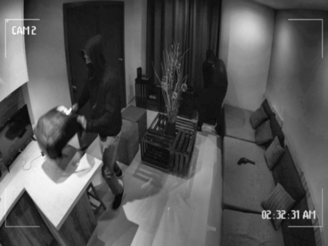 | 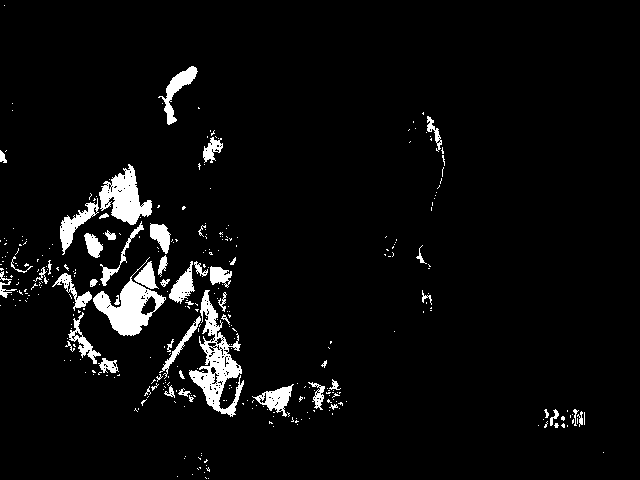 |

| Stage 3 — Cleaned | Stage 4 — Final Decision |
|---|---|
| 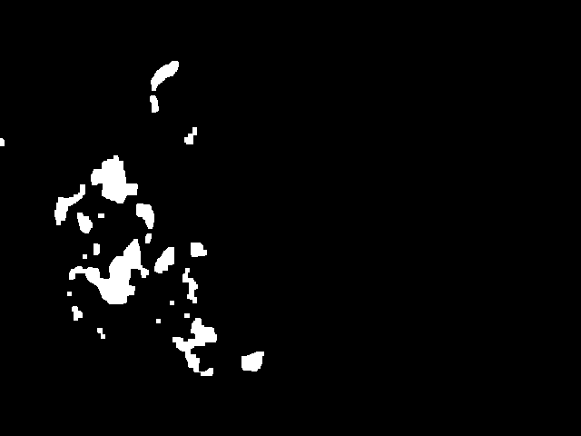 | 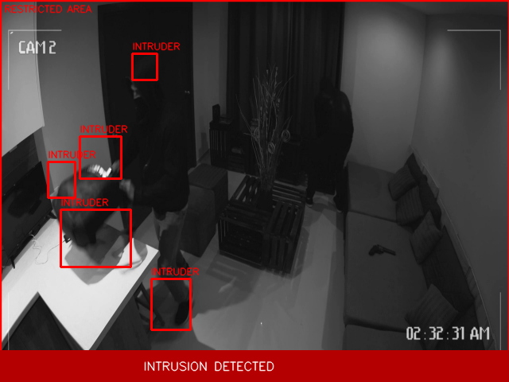 |

*Outcome:* Multiple moving subjects are each assigned separate bounding boxes; the
first box that overlaps the zone triggers the alarm. Simultaneous intrusions are
captured under a single logged event.

### 5.3 `intruder.mp4`

| Stage 0 — Original | Stage 1 — Enhanced | Stage 2 — Segmented |
|---|---|---|
|  | 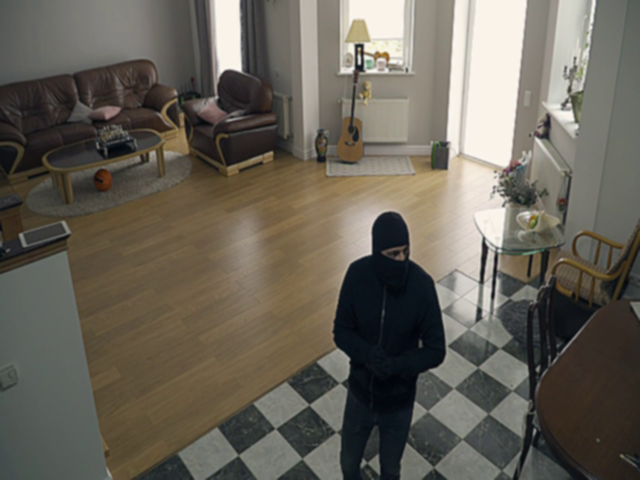 | 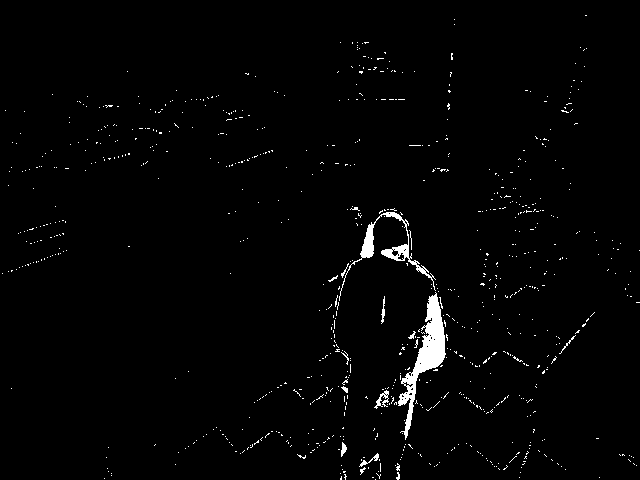 |

| Stage 3 — Cleaned | Stage 4 — Final Decision |
|---|---|
| 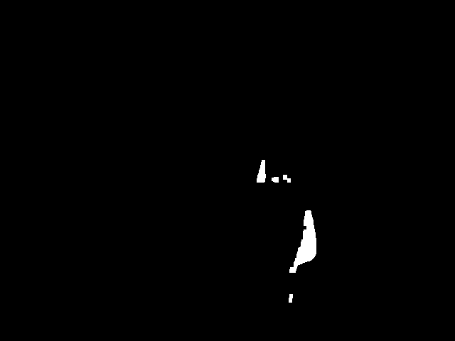 | 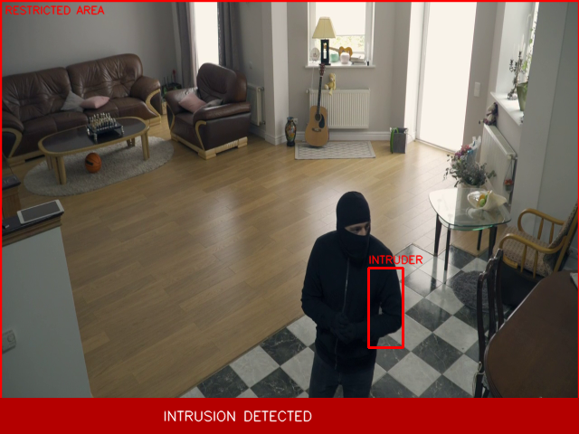 |

*Outcome:* Clip demonstrates a clear approach into the restricted area. The zone
outline transitions from yellow (monitoring) to red (alarm) as the subject crosses
the boundary.

---

## 6. Failure Cases

| Failure mode | Root cause | Mitigation |
|--------------|-----------|------------|
| False positive from non-human motion (pets, vehicles, waving foliage) | System detects any motion, not object class | Draw a tighter zone (`z` key) to exclude common false-alarm regions |
| Stationary intruder disappears after ~500 frames | MOG2 absorbs static objects into its background model over `MOG2_HISTORY` frames | Reduce `MOG2_HISTORY`; note this increases false positives during camera shake |
| Sudden global lighting change floods the mask | Whole-frame brightness shift violates the slow-adaptation assumption of MOG2 | Increase `MOG2_VAR_THRESHOLD`; CLAHE partially compensates in low-light transitions |
| Residual shadow blobs trigger false intrusions | Shadow pixels (labelled 127 by MOG2) that survive the 200-threshold | Reduce `SEGMENT_THRESHOLD`; increase `MIN_CONTOUR_AREA` |
| Small targets ignored | Contours below `MIN_CONTOUR_AREA = 400 px²` are discarded | Lower `MIN_CONTOUR_AREA` at the cost of more noise-driven detections |
| Camera vibration causes false background | Any pixel movement is treated as foreground | System requires a genuinely static camera; stabilisation pre-processing is out of scope |
| Multiple people merging into one bbox | Overlapping silhouettes produce a single merged contour | Reduce `MIN_CONTOUR_AREA` to split them, or apply connected-component labelling |

---

## 7. Conclusion

The five-stage classical pipeline meets the stated objective: it detects motion inside
a user-defined restricted zone in real time, produces visible interpretable overlays at
every stage, and logs each event to a timestamped CSV. No training data or GPU
resources are required.

Primary limitations follow from the motion-only detection paradigm and the MOG2
background model: any moving object can trigger the alarm, and a stationary intruder
will eventually be absorbed into the background. Future extensions could include
lightweight object classification (e.g. person vs. vehicle), optical flow to track
direction of entry, persistence logic to avoid absorbing stopped intruders, and
per-clip zone presets extending the current `RESTRICTED_ZONES` dictionary.

---

## 8. Usage and Instructions

### 8.1 Project structure

```
CV_INTRUSION_DETECTION/
├── data/               # Source video clips (not committed; download separately)
│   ├── walk.mp4
│   ├── thieves.mp4
│   └── intruder.mp4
├── docs/
│   └── images/         # Auto-generated stage images (committed)
├── outputs/            # Runtime saves: events.csv, saved frames (gitignored)
├── src/
│   ├── main.py         # Entry point and UI loop
│   ├── preprocessing.py
│   ├── filtering.py
│   ├── analytics.py
│   ├── events.py
│   ├── controls.py
│   ├── config.py
│   └── export_stages.py  # Report image generator
├── requirements.txt
└── README.md
```

### 8.2 Installation

```bash
pip install -r requirements.txt
```

Download `CV_VIDEOS.rar` and extract the three `.mp4` files into `data/`.

### 8.3 Running the application

```bash
python src/main.py                        # defaults to data/walk.mp4
python src/main.py --video thieves.mp4   # bare filename resolves inside data/
python src/main.py -v C:/path/to/clip.mp4
```

### 8.4 Controls

| Key | Action | Key | Action |
|-----|--------|-----|--------|
| `p` | Play / Pause | `s` | Save current frame to `outputs/` |
| `r` | Rewind 1 s | `j` | Cycle pipeline stage (0–4) |
| `f` | Fast-forward 1 s | `z` | Draw a new restricted zone |
| `q` | Quit | | |

Toolbar buttons mirror these shortcuts (except `z`, which is keyboard-only).
Keys are read by physical position and work regardless of OS keyboard layout.

### 8.5 Restricted zone

By default the entire frame is the restricted area, so any detected motion is an
intrusion. To monitor a sub-region:

1. Run the application and press `z`.
2. Drag a box over the desired area and press **Enter**.
3. The new zone applies immediately and a pasteable config line is printed:

```python
RESTRICTED_ZONES = {
    'walk.mp4': (x1, y1, x2, y2),
}
```

Add that line to `src/config.py` so the zone loads automatically on next run.
`DEFAULT_RESTRICTED_ZONE` (full frame) is the fallback for clips without an entry.

### 8.6 Event log

Intrusion events are appended to `outputs/events.csv`:

| Column | Description |
|--------|-------------|
| `timestamp` | Wall-clock time of the event (`YYYY-MM-DD HH:MM:SS`) |
| `event` | `INTRUSION_START` or `INTRUSION_END` |
| `duration_s` | Duration in seconds (populated on `INTRUSION_END`) |
| `bbox` | Bounding box of the first detected intruder (`xxywh` format) |

### 8.7 Regenerating report images

To regenerate the `docs/images/` PNGs after modifying the pipeline or swapping clips:

```bash
python src/export_stages.py
```

The script warm-ups MOG2 for 60 frames then captures the first intrusion frame (or
the mid-video frame as a fallback) for each `.mp4` in `data/`, writing 5 PNGs per clip.
